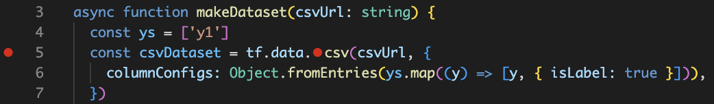

# Overview
This repository contains reproduction code for https://github.com/tensorflow/tfjs/issues/8150.

# Reproduction method
1. Set an inline breakpoint on `.csv` in `tf.data.csv` around line 5 of `src/index.ts`.
2. Run `npm run build` and `npm run debug` at `JavaScript Debug Terminal`.
3. Step in when it stops at the breakpoint.
4. Stop at the file `tf-data.node.js`. (note that it is not a TS or source-map related file.)

Breakpoints should be set like this. (Shift + F9 can be used to set them.)

# Versions
## Visual Studio Code
Version: 1.85.2 (Universal)  
Commit: 8b3775030ed1a69b13e4f4c628c612102e30a681  
Date: 2024-01-18T06:40:32.531Z  
Electron: 25.9.7  
ElectronBuildId: 26354273  
Chromium: 114.0.5735.289  
Node.js: 18.15.0  
V8: 11.4.183.29-electron.0  
OS: Darwin arm64 23.2.0  
